# E-commerce Analytics Agent

[](https://github.com/l-sd/ecommerce-analytics-agent/actions/workflows/ci.yml)

一个可复现的电商订单分析作品项目：从脏数据体检、清洗和口径确认开始，自动完成核心 KPI、渠道/商品分析、RFM 用户分层，并按**流量与转化 / 销售与商品 / 用户 / 履约跟踪**四个维度展开，生成公式化 Excel、带图表的单文件 HTML 报告和验证记录；同一套分析逻辑同时驱动一个可交互的在线仪表盘。

> **数据声明：** 仓库中的订单、流量与商品主数据全部由固定随机种子生成，是模拟练习数据，不包含真实企业、客户或交易信息。所有业务结论仅用于演示分析流程。

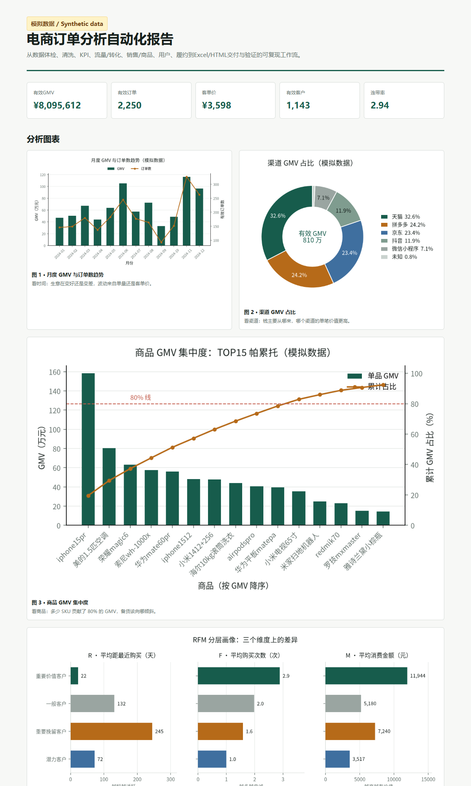

## 在线 Demo

交互式仪表盘：可上传自己的 CSV/XLSX、按日期与渠道筛选、实时重算 KPI，按概览 / 流量与转化 / 销售与商品 / 用户 / 履约跟踪五个 Tab 展开，并下钻 RFM 分层。

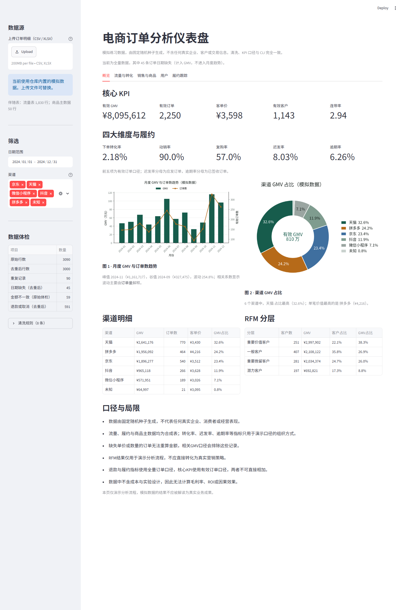

> **在线体验：** <https://b3a5c4dfd1bf4fdfa309ce85d78bb267.sg.agentos-app.run> —— 免安装，直接打开即可上传数据、按日期与渠道筛选、切换维度 Tab 并下载客户明细。

本地启动方式见[快速运行](#快速运行)。

## 项目产出

- **数据体检**：检查重复、日期/金额/数量异常、维度缺失和金额不一致。
- **可追溯清洗**：保留原金额，按 `单价 × 数量` 重算金额，并记录每一条清洗规则。
- **核心 KPI 与结构分析**：有效 GMV、订单量、客单价、连带率、渠道结构、月度趋势、商品集中度和 RFM 分层。
- **四大分析维度**：按流量与转化、销售与商品、用户、履约跟踪组织指标，每个维度自带数据口径、计算逻辑与局限说明；缺少对应数据源时该维度明确报告「不可用」及原因，而不是渲染一张空表。
- **九张业务图表**：时间、渠道、商品、客户、流量漏斗、渠道流量质量、品类结构、发货时效、履约趋势，每张图对应一个具体业务问题。
- **公式化 Excel**：13 个工作表，3,000 行清洗明细中的金额和有效订单标记由 6,000 个公式生成。
- **单文件 HTML**：图表以 base64 内嵌，无需服务端、无外部依赖即可打开。
- **结果验证**：GMV 双路径计算、渠道/月度/品类/地域回算、流量漏斗单调性与订单守恒、履约漏斗单调性、动销率分母来源、退款拆分、5 行抽样核对、Excel 公式逻辑审计、HTML 结构检查、图表写入与内嵌检查，共 17 项。
- **可复现性**：同一种子重新生成的数据与仓库文件逐字节一致，且由测试守住。

默认演示数据包含三张合成表：**3,090 行订单明细**（3,000 个唯一订单、90 行重复）、**1,830 行流量表**（366 天 × 5 渠道）和 **50 行商品主数据**。流水线可稳定识别 **46 条日期缺失**和 **59 条可核对金额不一致**记录。完整数据质量结果见 [`artifacts/demo/cleaning_log.json`](artifacts/demo/cleaning_log.json)。

## 分析结论与图表

每张图都回答一个具体问题，而不是只把数据画出来。

| 图 | 业务问题 | 本数据集上的结论 |
| --- | --- | --- |
| 图 1 · 月度 GMV 与订单数趋势 | 生意在变好还是变差？波动来自单量还是客单价？ | 峰值 2024-11（¥1,161,717），谷值 2024-09（¥327,475），波动 254.8%；与订单数相关系数 **0.96**、与客单价 **0.55**，说明**波动由订单量驱动**，而非客单价 |
| 图 2 · 渠道 GMV 占比 | 钱主要从哪来？哪个渠道的单笔价值更高？ | 天猫 32.6% 为最大来源；**拼多多客单价 ¥4,216 最高**，但 GMV 占比只有 24.2% |
| 图 3 · 商品 GMV 集中度 | 多少 SKU 贡献了 80% 的 GMV？ | **11 个 SKU 即达到 80%**，TOP15 累计 92.4%，第一名单品占 19.6% |
| 图 4 · RFM 分层画像 | 哪一类客户最该优先维护或挽回？ | 「重要价值客户」251 人（GMV 38.3%）人均 2.9 单、¥11,944，频次与金额均为最优；「重要挽留客户」281 人（GMV 26.0%）平均 **245 天**未回购，是最该召回的一层 |
| 图 5 · 流量转化漏斗 | 从曝光到下单，哪一环漏得最多？ | 曝光 736,792 → 访客 133,937 → 加购 36,947 → 下单 2,924；访客率 18.18%、加购率 27.59%、下单转化率 2.18%。绝对流失最大的是**曝光到访客（602,855 次）**，留存最低的是**加购到下单（7.91%）** |
| 图 6 · 渠道流量质量 | 哪个渠道的流量「更值钱」？ | 天猫的 GMV 份额比曝光份额高 **8.8 个百分点**（下单转化率 3.02% 最高）；抖音反过来低 **11.8 个百分点**（1.23% 最低），属于流量贵而产出低的一档 |
| 图 7 · 品类 GMV 结构 | 收入集中在哪些品类？ | **手机数码独占 61.6%**，前三品类合计 93.0%；食品占比仅 0.6%，是长尾里最薄的一层 |
| 图 8 · 发货时效分布 | 发货节奏是否稳定？迟发有多严重？ | 平均 1.54 天、中位 1 天，58.9% 的订单次日发出；迟发率 **8.03%**（166 / 2,067 单），高于行业常设考核线 4% |
| 图 9 · 履约趋势 | 迟发与逾期在一年里怎么走？ | 12 个月的迟发率**全部高于 4%**，均值 7.86%，峰值在 2024-05（11.18%）；逾期率均值 6.25% |

<table>
<tr>
<td width="50%">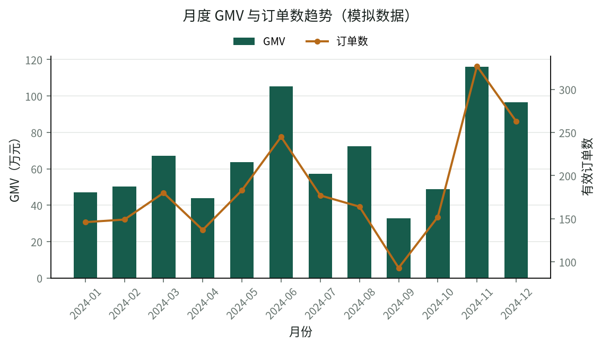</td>
<td width="50%">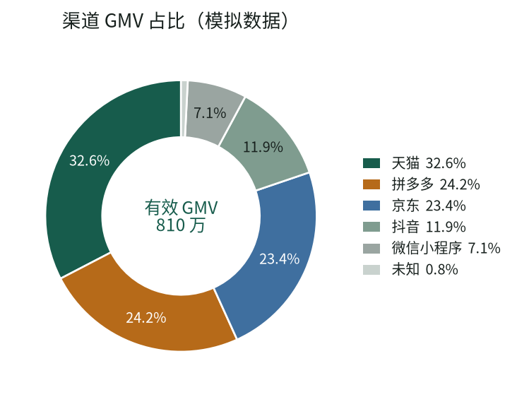</td>
</tr>
<tr>
<td colspan="2">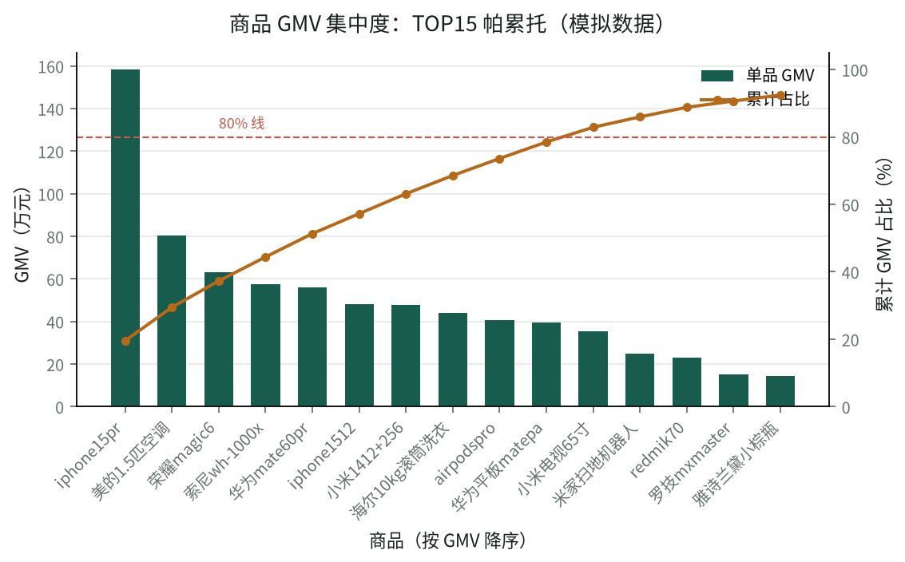</td>
</tr>
<tr>
<td colspan="2">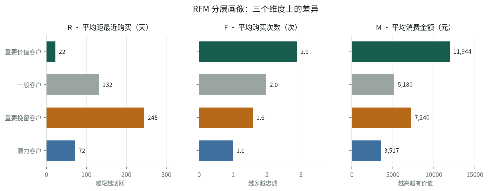</td>
</tr>
<tr>
<td width="50%">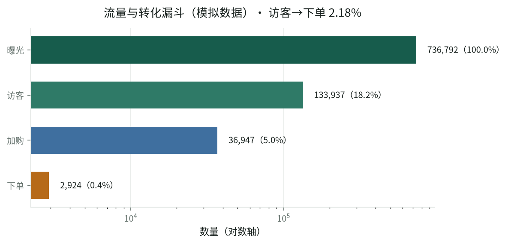</td>
<td width="50%">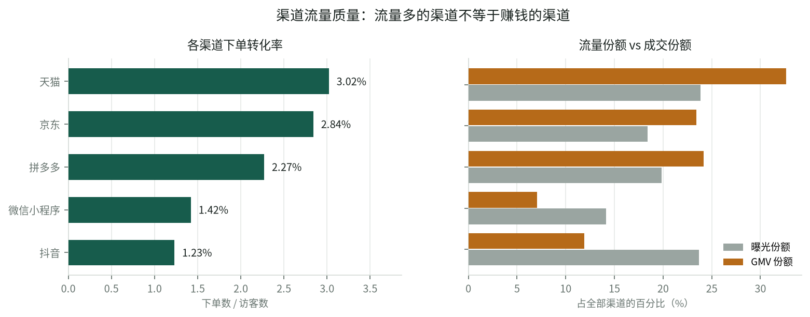</td>
</tr>
<tr>
<td width="50%">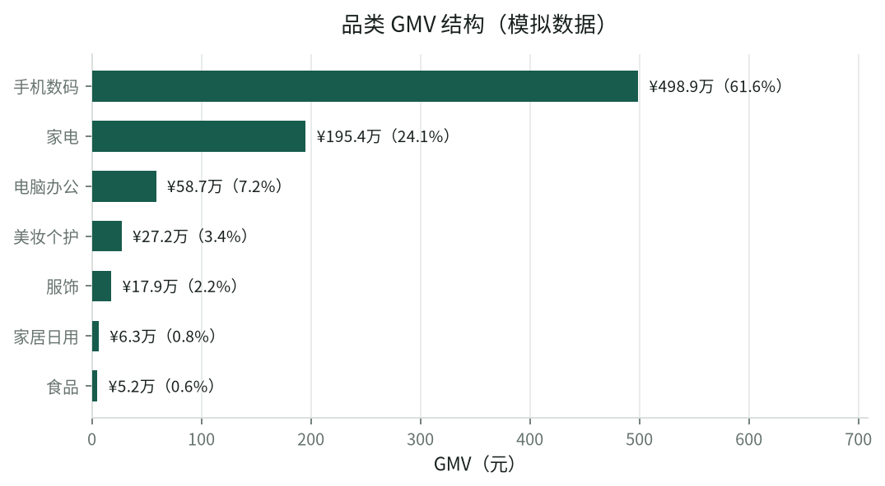</td>
<td width="50%">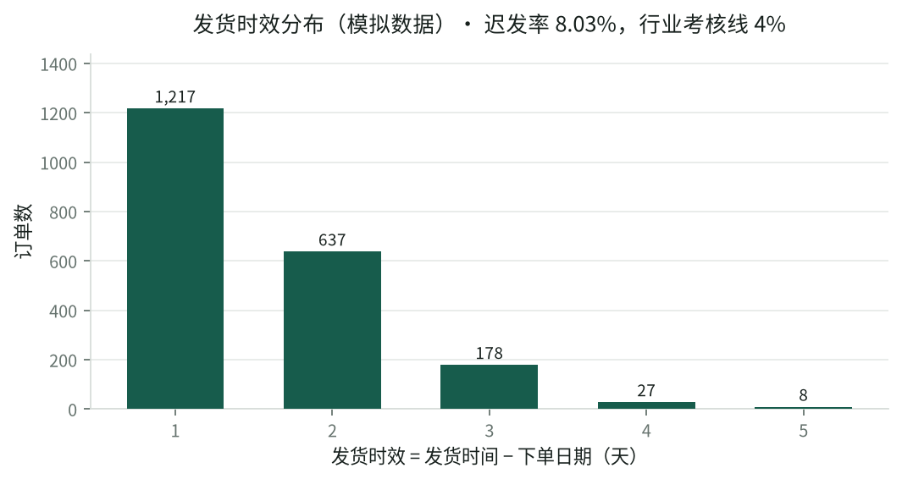</td>
</tr>
<tr>
<td colspan="2">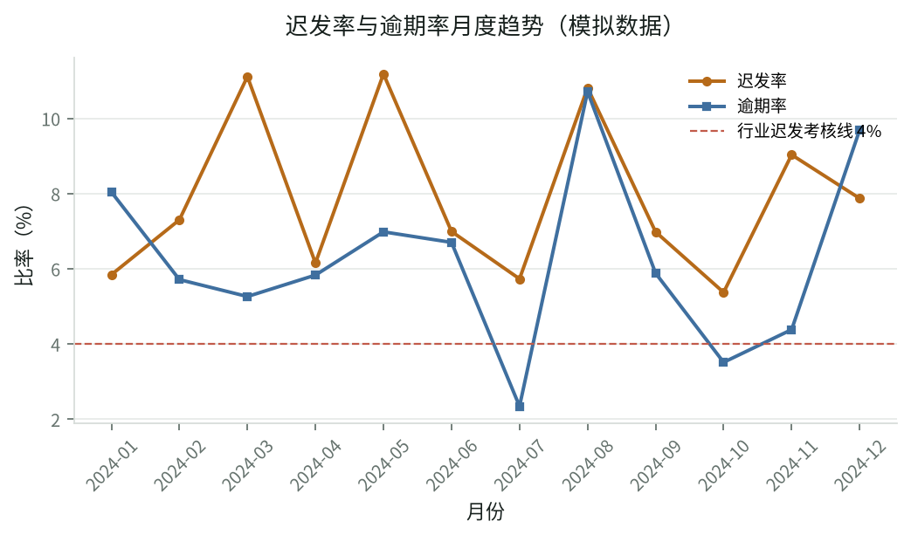</td>
</tr>
</table>

## 快速运行

要求 Python 3.11 或更高版本。

```bash
python -m venv .venv

# Windows
.venv\Scripts\activate
# macOS / Linux
source .venv/bin/activate

python -m pip install --upgrade pip
python -m pip install -e ".[dev]"          # 分析 + 测试
python -m pip install -e ".[dev,dashboard]"  # 再加上仪表盘
```

生成可复现的模拟数据，并运行完整分析：

```bash
python -m ecommerce_analytics generate-demo --rows 3000 --seed 20240601
python -m ecommerce_analytics run --input data/synthetic_orders.csv --output artifacts/demo
```

启动交互仪表盘：

```bash
streamlit run app.py
```

## 输出文件

| 文件 | 内容 |
| --- | --- |
| `cleaned_orders.csv` | 去重、标准化并保留追溯字段的清洗明细 |
| `cleaning_log.json` | 原始数据体检、清洗规则，以及哪些可选列由上传文件提供 |
| `analysis.json` | KPI、渠道、月度、商品、RFM，加上流量/销售/用户/履约四个维度与图表结论 |
| `ecommerce_analysis.xlsx` | 13 个工作表：公式化明细、分析摘要、渠道/月度/商品/RFM，以及流量与转化、品类分析、品牌分析、退款分析、地域分布、履约跟踪、口径与验证 |
| `report.html` | 带 9 张内嵌图表的单文件分析报告，四个维度各成一节 |
| `figures/*.png` | 九张业务图表 |
| `validation.json` / `validation.md` | 自动化验证结果和人类可读记录 |

仓库提交了默认参数生成的示例产物，招聘者无需运行代码也能直接查看结果。

## 数据口径治理

每个数字都必须能回答「怎么算的、排除了什么、在哪里验证」。

订单明细的必需列为 11 列；另有 7 列可选列（商品品类、承诺发货时效、物流商、承诺送达时效、发货时间、签收时间、退款原因）。上传的文件没带这些列时，依赖它们的维度会明确报告不可用——**缺席与「未知」是两种状态**，把缺失填成「未知」会让可用性判断说谎。

| 指标 | 口径 | 验证方式 | 排除项 |
| --- | --- | --- | --- |
| 有效订单 | 订单状态不为「已退款」「已取消」，且金额可重算 | 与清洗日志计数交叉核对 | 退款、取消、金额无法重算的订单 |
| GMV | 有效订单的 `单价 × 数量` 之和 | **双路径**：与原始「金额」列分别求和，差额须为 0 | 同上 |
| 客单价 | 有效 GMV / 有效订单数 | 分母口径与「有效订单」一致 | 无 |
| 连带率 | 有效商品件数 / 有效订单数 | 与有效订单数同源 | 数量缺失的订单 |
| 渠道 / 月度 / 商品 | 在有效订单上按维度汇总 | 各维度汇总须能回算到有效 GMV | 渠道缺失记为「未知」；日期缺失不进入月度 |
| 流量与转化 | 曝光/访客/加购来自合成流量表；**下单数由订单明细按渠道 × 日期回填** | 逐行漏斗单调（曝光 ≥ 访客 ≥ 加购 ≥ 下单）+ `Σ下单数` 与可归属订单严格守恒 | 渠道未知或日期不可解析的订单不进入漏斗 |
| 品类 / 品牌 | 品类来自订单列；品牌来自商品主数据，按商品 ID 连接 | 品类汇总回算到有效 GMV；品牌是 TOP10 切片，**不回算** | 未提供主数据时品牌不可用；连不上主数据的订单不计入品牌 |
| 动销率 | 有销量 SKU / **商品主数据中的在售 SKU** | 分母须来自主数据且 > 0；有销量 SKU ⊆ 在售 SKU | 未提供主数据时该指标不可用——用明细反推会让它恒为 100% |
| 退款 | 已退款订单 / **该渠道全量订单**（含退款与取消） | 有效 GMV + 退款金额 + 取消金额 = 全量金额绝对值之和 | 分母与核心 KPI 不同，两者不可相加或对比 |
| 复购 / 集中度 | 有效订单中下单 ≥ 2 次的客户 / 有效客户数 | 频次分桶人数合计等于有效客户数 | 未合并同一自然人账号；窗口仅一年 |
| 地域 | 有效订单按收货省份汇总 | 各省汇总回算到有效 GMV | 省份缺失记为「未知」 |
| 发货 / 签收时效 | 发货时间 − 下单日期；签收时间 − 发货时间 | 迟发率分母 = 应发订单数；逾期率分母 = 已签收订单数 | 待发货不进迟发分母；窗口末端的在途订单会低估签收率 |
| RFM | 排除未知用户与缺失日期，按最近购买、频次、金额各三等分 | 分位用 `rank` 后切分，规避并列值 | 未知用户、日期缺失、无效订单 |

**明确不计算**：毛利率、ROI、因果效果、真实埋点级行为。流量与转化率只能来自显式的合成流量表，不从订单明细反推；数据里没有成本、曝光明细或实验设计，任何这类指标都只能是编造。

## 验证

```bash
pytest                                    # 191 个测试
ruff check .                              # 代码风格
```

测试覆盖：数据清洗边界、日期解析（含 Excel 序列号开区间）、输入错误处理、图表空输入与配色循环、RFM 分层画像的分层取值与配色一致性、图表行布局（宽图独占整行）、仪表盘端到端渲染、四个维度的口径与守恒、流量表漏斗不变量、以及**数据可复现性**。

流水线自带 17 项验证，全部通过后才会以退出码 0 结束；任一项失败会以非零退出码中止，因此可以直接用于 CI 门禁。默认数据的关键断言：

- 3,090 行、3,000 个唯一订单、90 行重复；
- 46 条日期缺失、140 条单价缺失或不可解析、57 条数量缺失；
- 61 条数量为 0、284 条负数量、335 条金额缺失；
- 59 条可核对金额不一致；
- GMV 双路径差额 ¥0.00，渠道、月度、品类、地域四路汇总均能回算到有效 GMV（¥8,095,612.20）；
- 流量表 1,830 行逐行漏斗单调，`Σ下单数` 2,924 与可归属订单数严格相等；
- 履约漏斗 3,000 → 2,067 → 1,630 单调，动销率分母 45 / 50 来自商品主数据；
- 有效 GMV + 退款金额 + 取消金额 = 全量金额绝对值之和（¥9,835,592.50）；
- Excel 6,000 个公式无异常行，HTML 关键区块与 9 张内嵌图表完整。

### 跨平台验证

依赖在 Windows 上从零安装并跑通全流程，实测记录（含 `pip freeze`、可复现性哈希、以及修复的两个真实缺陷）见 [`docs/environment-verified.md`](docs/environment-verified.md)。

CI 在 **Ubuntu / Windows / macOS × Python 3.11 / 3.12 / 3.13** 共 9 个组合上运行 lint、测试和完整流水线，并在 Linux 上安装 `fonts-noto-cjk` 以保证图表中文不出现豆腐块。

## 项目结构

```text
app.py                 # Streamlit 交互仪表盘（5 个 Tab）
src/ecommerce_analytics/
  demo_data.py         # 固定种子模拟数据（订单 + 流量 + 商品主数据）
  pipeline.py          # 数据体检、清洗，并作为 analyze_orders 门面
  analysis/            # 四个维度各一个模块，口径与局限随数字一起返回
  visuals.py           # 九张业务图表（含跨平台中文字体回退）
  deliverables.py      # Excel、HTML 和验证记录
  cli.py               # 命令行入口
tests/                 # 清洗、日期、错误处理、图表、仪表盘、维度分析、流量表、可复现性
data/                  # 提交的模拟订单、流量表、商品主数据及生成清单
artifacts/demo/        # 提交的示例交付物
docs/figures/          # README 引用的图表
packages.txt           # Streamlit Cloud 需要的系统包（CJK 字体）
```

## 局限

这是作品集中的流程演示，不是生产系统。模拟数据的 GMV、复购、转化率或履约表现都不应被解释为真实业务成果；报告中的结论仅展示分析组织方式。

数据包含订单明细、合成流量表和商品主数据三张表，因此能演示流量转化、动销率和履约时效的组织方式；但这些数字由固定种子生成，只用于验证流程能识别预设模式（例如抖音的高退款率、11 月的订单高峰、邮政的高迟发率）。数据里没有成本、曝露出处或实验设计，所以仍然无法计算毛利率、ROI 或因果增量；缺失单价或数量的订单无法重算金额，相关 GMV 口径会排除这些记录。

项目不包含数据库、实时任务调度、权限系统或线上监控。

## License

Project code and synthetic data are available under the MIT License. Dependency notices are listed in [`THIRD_PARTY_NOTICES.md`](THIRD_PARTY_NOTICES.md).
